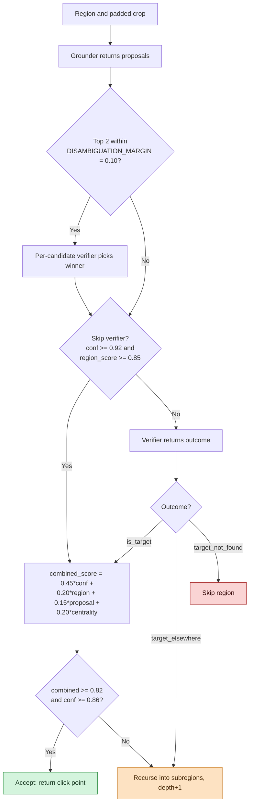
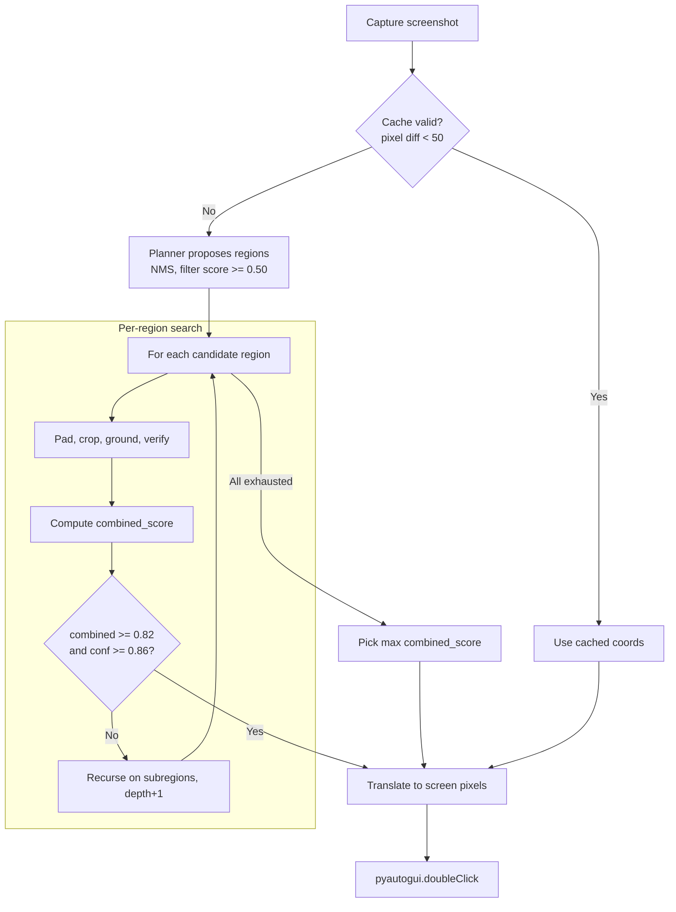

# Vision-based desktop automation

## Overview

A Windows desktop automation pipeline that locates and clicks GUI icons using a planner → grounder → verifier vision pipeline, then drives Notepad to write and save the first ten posts from JSONPlaceholder. The implementation is inspired by **ScreenSeekeR** ([arXiv:2504.07981](https://arxiv.org/pdf/2504.07981)): hierarchical visual grounding where a planner narrows the search area before a grounder returns pixel coordinates.

The brief calls out three problems:
- **Locate the target icon dynamically.** The Notepad shortcut may sit anywhere on the desktop; the system must find it without hardcoded coordinates and survive a cluttered or rearranged layout.
- **Drive the application reliably end-to-end.** Each post must open Notepad, paste the title and body, save as `post_{id}.txt`, close, and recover from save dialogs, overwrite prompts, hidden windows, and transient pop-ups.
- **Generalize to other targets.** The same code is expected to handle other desktop icons (Recycle Bin, VLC, Calculator, browsers) by passing a single `--target` description, with no per-app logic.

---

## Quick start

### Prerequisites

- Windows 10 or 11
- Python 3.10+
- [uv](https://github.com/astral-sh/uv) for dependency management (`pip install uv`)
- `GEMINI_API_KEY` set as an environment variable
- A visible target icon on the desktop (Notepad shortcut for the default workflow)
- 1920×1080 display recommended; other resolutions are supported via DPI auto-detection

### Install

```powershell
pip install uv
uv sync
$env:GEMINI_API_KEY="your_real_gemini_api_key_here"
```

The API key is read from the environment by `config.py`; it is never hardcoded. A `.env.example` is included as a safe placeholder. Persist the variable across shells via `setx GEMINI_API_KEY "your_key"` if you do not want to re-set it each session.

### Run — default Notepad workflow

```powershell
uv run vision-automation
```

Processes the first 10 posts from [JSONPlaceholder](https://jsonplaceholder.typicode.com/posts), writes each into Notepad, saves as `post_{id}.txt` under `Desktop/tjm-project/`. The cold start runs full planner → grounder → verifier; posts 2–10 take the cache path and skip the VLM entirely.

### Run — generic workflow with custom target

```powershell
uv run vision-automation --target "VLC media player icon"
uv run vision-automation --target "Recycle Bin icon"
uv run vision-automation --target "Notepad desktop shortcut icon" --posts 3
```

When `--target` is set without `--app`, the workflow defaults to `generic` (find icon, double-click, exit). Pass `--app notepad` to force the full post-writing flow with a custom target description, or `--app generic` to override the auto-detection.

### Optional flags

| Flag | Default | Effect |
| ---- | ------- | ------ |
| `--target "<desc>"` | Notepad description from `config.py` | Override the target icon description |
| `--posts N` | 10 | Limit the number of posts processed |
| `--output-dir <path>` | `~/Desktop/tjm-project` | Override the output directory |
| `--app {notepad,generic}` | auto | Force a workflow (auto = `generic` if `--target` set, else `notepad`) |
| `--search-mode {fast,robust}` | `fast` | `fast` returns one best region; the alternative returns multiple plausible regions |

### Alternative entry points

```powershell
uv run python -m vision_desktop_automation.main          # equivalent to vision-automation
uv run python -m vision_desktop_automation.launcher      # Tkinter launcher GUI
```

The Tkinter launcher exposes the same `--target`, `--posts`, `--app`, and `--search-mode` overrides through a simple form, plus an "upload template image" button that copies a chosen image into `templates/` so the OpenCV fallback can use it. A shortcut `run_gui.bat` is included for double-click launch from File Explorer.

### What a single post does

For each post processed in the default workflow:

1. **Clear the desktop.** Win+D, then `reset_ui_state` sends Escape and waits briefly to dismiss any transient overlay (Task View, Start menu, snipping tool).
2. **Take a screenshot** and save it to `screen.png` (the same file is overwritten on every attempt — debugging artifact).
3. **Locate the Notepad icon** via the cache fast-path if available, otherwise the full planner → grounder → verifier chain.
4. **Move the cursor to a safe position** (bottom-right minus 20px) before clicking, so a stray mouse-already-at-corner state does not trigger the PyAutoGUI fail-safe.
5. **Double-click** at the detected coordinates with a 0.2s interval between clicks.
6. **Poll for the Notepad window** every 0.2 seconds for up to 12 seconds. If nothing appears, try select-and-Enter as a GUI fallback, then an offset double-click as the last resort before invalidating the cache.
7. **Paste the formatted content** via clipboard (`pyperclip.copy` + `Ctrl+V`) and verify the unsaved-changes asterisk appears in the window title.
8. **Save as `post_{id}.txt`** in `Desktop/tjm-project/` — Ctrl+S, wait for the Save As dialog, paste the full path, press Enter, and confirm Replace if the file already exists.
9. **Verify the file exists and is non-empty** on disk; raise if not.
10. **Close Notepad** via Ctrl+W (preferred over Alt+F4, which can accidentally trigger the Windows Shutdown dialog if focus shifts to the desktop mid-call).

After all posts are processed, a final `close_all_notepad_windows` pass catches any leftover Notepad windows the per-post close may have missed.

### Output format

Each post is saved as a plain-text file at `Desktop/tjm-project/post_{id}.txt` with the content:

```text
Title: {title}

{body}
```

After the run, `verify_outputs` ([files.py](src/vision_desktop_automation/files.py)) re-reads each expected file and confirms the title line matches the API response. Missing or empty files are reported in the final summary; the run does not silently pass if any post failed.

---

## Architecture

The pipeline has three named stages, each separately prompted and each with a narrow job. The shape matches ScreenSeekeR's three-stage cascade: a planner that turns the full image into a small set of focused regions, a grounder that locates the target inside one region at a time, and a verifier that double-checks whether the located patch actually contains the target. What differs from the paper is which model fills each role and how the per-stage outputs are combined — those choices are defended in the "Design choices and paper deviations" section below.

All three stages call the same Gemini model (`gemini-2.5-flash` by default, configurable via `VLM_MODEL` in `config.py`) with different prompts. Calls use `temperature=0.0` and `responseMimeType=application/json` so the model returns parseable structured output rather than prose. The shared transport layer in `vlm_client.py` retries 5xx and timeout errors with exponential backoff (3s, 6s, 12s, capped at 45s) and surfaces 4xx errors immediately with the Google error body preserved in the exception.

### Planner

Located at [grounding.py:64](src/vision_desktop_automation/grounding.py#L64) (`propose_candidate_regions`). Receives the full 1920×1080 desktop screenshot and returns up to 5 candidate bounding regions where the target is likely to live, each with a score in `[0,1]`. Regions below `MIN_PLANNER_REGION_SCORE = 0.50` are dropped; remaining regions go through NMS (`REGION_NMS_IOU_THRESHOLD = 0.60`) so heavily overlapping proposals do not waste grounder calls. The planner runs in `fast` mode (single best region) by default; the alternative mode (see the optional flags table) returns multiple plausible regions for the grounder to evaluate in turn.

Region boxes below `MIN_REGION_WIDTH_PX = 80` or `MIN_REGION_HEIGHT_PX = 80` are expanded against the screen bounds — a tight planner box around a tiny icon would clip the label and starve the grounder of context, so the system adds padding before cropping.

### Grounder

Located at [grounding.py:464](src/vision_desktop_automation/grounding.py#L464) (`vlm_ground_icon`). Receives a cropped candidate region and returns up to 4 box proposals, each with `confidence`, `label_match`, `visual_match`, and a tight bounding box. If the top two proposals are within `DISAMBIGUATION_MARGIN = 0.10` of each other, the grounder runs a per-candidate verifier pass (`disambiguate_proposals` at [grounding.py:410](src/vision_desktop_automation/grounding.py#L410)) — this is what catches Notepad vs Notepad++ when both icons appear on the same desktop.

The grounder also has its own internal zoom loop: if the top proposal's confidence is below `SEARCH_CONFIDENCE_THRESHOLD = 0.85` and depth is under `MAX_SEARCH_DEPTH = 3`, the grounder crops around its own best guess and recurses on the smaller image — useful when the planner's region was correct but loose.

### Verifier

Located at [grounding.py:325](src/vision_desktop_automation/grounding.py#L325) (`verify_icon_identity`). Crops a 48px-pad square around the grounder's click point and asks Gemini to return one of three labels: `is_target`, `target_elsewhere`, or `target_not_found`. The three-state schema is taken directly from ScreenSeekeR Table 8. Verification is skipped when both planner and grounder are highly confident (`VERIFICATION_SKIP_CONFIDENCE = 0.92` and `VERIFICATION_SKIP_REGION_SCORE = 0.85`) to save one API call per region on easy cases.

The `target_elsewhere` branch is wired into the search loop: when the verifier signals that the icon is in the screenshot but not at the proposed coordinates, the candidate is rejected but the search continues with the next planner region rather than failing the whole call.

The four prompt templates ([prompts.py](src/vision_desktop_automation/prompts.py)) are kept short and JSON-schema-strict so partial recovery has a chance when the model truncates. The verifier prompt explicitly enumerates the three allowed result values and requires the `reason` to be 20 words or fewer; the grounder prompt mandates that every proposal carries both a box and a click point, and an empty `proposals: []` is the canonical "not found" signal rather than a free-text excuse.

### Combined score

When a region produces a verified candidate, the final ranking score is a weighted sum of four signals ([grounding.py:617-628](src/vision_desktop_automation/grounding.py#L617)):

```
combined_score = 0.45 * confidence
               + 0.20 * region_score
               + 0.15 * proposal_score
               + 0.20 * centrality
```

- `confidence` (weight 0.45) — the grounder's self-reported confidence in this specific box.
- `region_score` (weight 0.20) — the planner's score for the parent candidate region.
- `proposal_score` (weight 0.15) — itself a sub-blend: `0.50·confidence + 0.30·label_match + 0.20·visual_match`. This carries the label-text agreement signal that catches Notepad++ collisions.
- `centrality` (weight 0.20) — Gaussian decay from the geometric center of the parent region, implemented per ScreenSeekeR Equation 1 with `σ = 0.3` ([grounding.py:220](src/vision_desktop_automation/grounding.py#L220)). A box centered in its region scores 1.0; a box at the corner scores near 0.

The confidence weight dominates because Gemini's self-reported confidence is empirically the strongest single signal, but no signal can win alone — a high-confidence box at the edge of a wrong region still loses to a moderate-confidence box centered in a high-score region.

### Recursion under uncertainty

`search_region_recursive` ([grounding.py:539](src/vision_desktop_automation/grounding.py#L539)) handles the case where the planner's first split was wrong. If the verified candidate scores below the acceptance gate (`RECURSIVE_ACCEPT_SCORE = 0.82` and `RECURSIVE_ACCEPT_CONFIDENCE = 0.86`), the planner is re-invoked on the current crop to produce sub-regions, and each sub-region is searched in turn. Depth is bounded by `RECURSIVE_PLANNER_DEPTH = 2` so a failing case cannot fan out indefinitely. A high-confidence inner grounder result inside an asymmetrically-padded edge crop can still terminate early via `vlm_ground_icon`'s own depth-3 zoom loop.

### Decision logic for one region

The diagram below shows the inside of one `search_region_recursive` iteration: how a single region+padded-crop pair is taken through grounding, optional disambiguation, the skip-verify gate, the verifier outcome branch, scoring, and the acceptance gate that decides between accepting, recursing into subregions, or skipping the region entirely.



The disambiguation step at C fires inside `vlm_ground_icon` *before* the outer verifier; it is a per-proposal verifier pass that runs only when the top two grounder proposals are too close to rank by raw score. The skip-verify gate at E bypasses the outer verifier when both the planner's region score and the grounder's confidence are high enough that re-checking would not change the outcome.

### Cache as the fast path

After the first successful detection, the system stores the absolute click coordinates and a small reference crop of the icon. On subsequent calls, `icon_still_at_cached_location` compares the live pixels at the cached coordinate against the reference using two pixel-diff thresholds (`CACHE_STRONG_DIFF_THRESHOLD = 50` for a confident match, `CACHE_TOLERANT_DIFF_THRESHOLD = 100` for a softer match). When the cache is valid, the entire planner → grounder → verifier chain is skipped — this is why a 10-post run uses one Gemini grounding call instead of ten. When the cache fails (icon moved, desktop background changed under it, theme switched), it is invalidated and the next call falls back to the full pipeline.

### Why hierarchical beats flat grounding

A single VLM call asking "where is icon X?" on a 1920×1080 desktop is unreliable for small targets: a typical desktop icon occupies under 0.5% of the image area, and the model's spatial precision degrades with image size. Splitting into regions reduces visual complexity per call — each grounder call sees roughly 10–20% of the desktop, where the icon is a much larger fraction of the view and the surrounding label text is legible. Recursion handles cases where the planner's first split was wrong: instead of failing, the system re-plans within the current crop and tries again. This is what makes the system tolerant of unexpected pop-ups, shifted icons, and cluttered desktops without prior knowledge of what the desktop looks like.

### Flow diagram



### Hyperparameter reference

All values live in [config.py](src/vision_desktop_automation/config.py):

| Knob | Value | Purpose |
| ---- | ----- | ------- |
| `GROUNDING_CONFIDENCE_WEIGHT` | 0.45 | Combined-score weight on grounder confidence |
| `REGION_SCORE_WEIGHT` | 0.20 | Combined-score weight on planner region score |
| `BOX_SCORE_WEIGHT` | 0.15 | Combined-score weight on proposal sub-blend |
| `CENTRALITY_WEIGHT` | 0.20 | Combined-score weight on Gaussian centrality |
| `CENTRALITY_SIGMA` | 0.3 | Bell-curve width for centrality, per paper Eq. 1 |
| `SEARCH_CONFIDENCE_THRESHOLD` | 0.85 | Grounder zoom-recurse trigger |
| `RECURSIVE_ACCEPT_SCORE` | 0.82 | Early-accept gate for combined score |
| `RECURSIVE_ACCEPT_CONFIDENCE` | 0.86 | Early-accept gate for confidence |
| `VERIFICATION_SKIP_CONFIDENCE` | 0.92 | Skip-verifier gate (grounder side) |
| `VERIFICATION_SKIP_REGION_SCORE` | 0.85 | Skip-verifier gate (planner side) |
| `DISAMBIGUATION_MARGIN` | 0.10 | Per-candidate verifier trigger for close proposals |
| `MIN_PLANNER_REGION_SCORE` | 0.50 | Drop low-score planner regions before NMS |
| `REGION_NMS_IOU_THRESHOLD` | 0.60 | Region-level NMS overlap |
| `BOX_NMS_IOU_THRESHOLD` | 0.50 | Proposal-level NMS overlap |
| `MAX_SEARCH_DEPTH` | 3 | Grounder internal zoom depth bound |
| `RECURSIVE_PLANNER_DEPTH` | 2 | Outer planner re-invocation depth bound |
| `ICON_DETECTION_RETRIES` | 3 | Per-session retries on full pipeline failure |
| `TEMPLATE_MATCH_THRESHOLD` | 0.82 | OpenCV fallback acceptance score |
| `MAX_CANDIDATE_REGIONS` | 5 | Hard cap on planner output |
| `MAX_GROUNDING_PROPOSALS` | 4 | Hard cap on grounder output per region |
| `MIN_REGION_WIDTH_PX` | 80 | Minimum region width before expansion |
| `MIN_REGION_HEIGHT_PX` | 80 | Minimum region height before expansion |
| `PATCH_THRESHOLD_PX` | 400 | Grounder zoom-recurse minimum crop size |
| `CACHE_STRONG_DIFF_THRESHOLD` | 50 | Pixel-diff threshold for confident cache match |
| `CACHE_TOLERANT_DIFF_THRESHOLD` | 100 | Pixel-diff threshold for soft cache match |
| `API_RETRIES` | 3 | Gemini transport retry count on 5xx/timeout |
| `NOTEPAD_OPEN_WAIT_MAX` | 12 | Seconds to poll for Notepad window after click |

---

## Results

| Metric                                          | Result                          |
| ----------------------------------------------- | ------------------------------- |
| End-to-end 10-post Notepad workflow             | ~2 minutes per full run         |
| Gemini grounding calls per session              | 1 (cold), then cache for posts 2–10 |
| Position coverage                               | Top-left, top-right, bottom-right, bottom-left — all passing |
| DPI scaling coverage                            | 100%, 125%, 200% — all passing  |
| Generic workflow (no code change)               | Recycle Bin, VLC — same pipeline |
| Disambiguation under collision                  | "notepad++" placeholder + real Notepad — picks real Notepad |
| Icon detection retries available per session    | 3                               |
| Fallback layers                                 | 4 (cache → planner-guided VLM → direct VLM → template match) |

### Per-post breakdown

- **Cold start (post 1)**: planner call + grounder call (+ verifier if confidence under 0.92) → double-click → poll for window → paste → save → close. Roughly 12–18 seconds depending on Gemini latency.
- **Warm posts (2–10)**: cache validation (local pixel diff, no API) → double-click → paste → save → close. Roughly 8–10 seconds each.
- **Save dialog wait** is bounded by `wait_for_save_dialog` (5 seconds, 0.5s polling). Window-title polling for Notepad launch is 0.2s ticks for up to 12 seconds (`NOTEPAD_OPEN_WAIT_MAX = 12`).
- **API budget for a 10-post run**: 1 planner + 1 grounder call on the cold start. Verifier is usually skipped because grounder confidence is well above 0.92 on a clean desktop. All 9 subsequent posts skip the API entirely via the pixel-diff cache.

### Generalization evidence

The generic workflow is the same code path as the Notepad workflow, minus the paste/save/close steps. The grounder prompt accepts any target description, and the planner prompt uses the same `{target_description}` placeholder. There is no per-target branching in the search code; the only target-specific input is the description string.

Tested targets that worked without any code change:

- `--target "Recycle Bin icon"` — bottom-left of a freshly-installed Windows desktop.
- `--target "VLC media player icon"` — center cluster with surrounding shortcuts.
- `--target "Notepad desktop shortcut icon"` with a Notepad++ shortcut also on the desktop — picks the real Notepad via the disambiguation pass.

The placeholder test in particular is the one that exercises the verifier: a file renamed to `Notepad++` was placed on the desktop next to the real Notepad shortcut, and the grounder's top two proposals came back within `DISAMBIGUATION_MARGIN = 0.10`. The per-candidate verifier pass correctly identified the real Notepad based on label-text match, even though both icons used near-identical document-with-lines glyphs.

### Detection examples

The following screenshots are stored in `docs/screenshots/`.

#### Top-left annotated detection


#### Top-left popup confirmation


#### Center annotated detection


#### Center popup confirmation


#### Bottom-left annotated detection 1


#### Bottom-left annotated detection 2


#### Bottom-right popup confirmation


---

## Design choices and paper deviations

### Why Gemini instead of OS-Atlas-7B (the paper's grounder)

The paper's own ablation answers this question more cleanly than any cost argument could. On ScreenSpot-Pro, **OS-Atlas-7B used alone scores 18.9%, but the same OS-Atlas-7B wrapped in the ScreenSeekeR planner → grounder → verifier pipeline jumps to 48.1%** (ScreenSeekeR, Table 2). That is a 29-point jump from the search method, not the grounder. The pipeline is doing the heavy lifting; the grounder is interchangeable.

For the icon-on-Windows-desktop case — which is far easier than the professional CAD and engineering software ScreenSpot-Pro was built around — a generalist VLM running in the same pipeline is a defensible substitution. OS-Atlas was tuned on a specialist UI corpus to extract every percentage point on hard benchmarks, but desktop shortcuts have label text right next to the icon, and label-text agreement is exactly the kind of signal a generalist VLM handles well. Cost and latency are supporting factors, but not the headline; the headline is that the search method dominates the grounder choice.

### Four-signal combined score instead of pure centrality voting

ScreenSeekeR uses centrality voting at its core because OS-Atlas-7B exposes neither a self-reported confidence number nor a label-text match score — the only reliable signal it produces is "which box did the grounder put where," and those box geometries get voted across multiple grounder runs using the Gaussian centrality kernel. Gemini does expose both confidence and label match, so the implementation here uses them: confidence (0.45) and proposal score (0.15, which itself blends label and visual match) carry most of the ranking weight.

Centrality drops from a dominant role to a tiebreaker role at 0.20 — still load-bearing, since it catches geometric anomalies (an icon detected at the very edge of its region is suspicious even when confidence is high), but no longer the sole decision signal. Sigma is kept at the paper's recommended 0.3 so the centrality kernel itself is unchanged; only its weight in the final blend is reduced.

### Box-center click derivation instead of trusting the grounder's click

Gemini emits both a bounding box and a separate `click_x_pct` / `click_y_pct` point. Empirically, the click point drifts outside its own bounding box often enough to matter — the model gets the icon's extents right but mis-reports the center, often biasing toward the label text below the icon rather than the icon glyph itself. On a Windows desktop where label text and icon glyph occupy adjacent vertical bands, that drift is enough to send a double-click to whitespace.

The fix is at [grounding.py:301-302](src/vision_desktop_automation/grounding.py#L301): after the box passes validation, the click point is overridden with the geometric center of the box. The commit `b2599f4` ("Use grounder's box center as click target instead of model's click point") captures this. It is one of those single-line changes that moves the failure rate visibly without changing any other behavior — the box corners are what the model attends to most carefully, and the box center derived from those corners is more stable than whatever the model produces for the click point.

---

## Robustness mechanisms

- **Retry loop with bounded backoff.** Up to 3 attempts per icon detection (`ICON_DETECTION_RETRIES = 3`) with 1-second delays between attempts; 10-second backoff on HTTP 429 from Gemini. Gemini transport itself retries on 5xx with exponential backoff (3s, 6s, 12s, capped at 45s).
- **Window-title validation after each click.** Polls `GetForegroundWindow` every 0.2 seconds for up to 12 seconds to confirm Notepad actually launched — half a second granularity in the old code, now 0.2 seconds, which detects launches 0.5–0.8s earlier on average.
- **Three-state verifier** (`is_target` / `target_elsewhere` / `target_not_found`) with skip-verify gate when planner score ≥ 0.85 and grounder confidence ≥ 0.92. Verifier defaults to `is_target` on transport errors so a flaky network does not block a high-confidence detection.
- **Disambiguation between close grounding proposals** via per-candidate verifier calls — triggered when the top two proposals are within `DISAMBIGUATION_MARGIN = 0.10`. Each candidate is cropped and verified independently, and the verified one wins even if it had the lower raw confidence. This handles the Notepad vs Notepad++ case explicitly.
- **Template-matching fallback** when VLM grounding raises. OpenCV multi-scale match across 8 scale factors from 0.70× to 1.50×, threshold `TEMPLATE_MATCH_THRESHOLD = 0.82`. Templates live in `templates/` and can be regenerated per machine.
- **Full-screen direct grounding** (`ALLOW_DIRECT_GROUNDING_FALLBACK = True`) sits between planner-guided search and template matching — when the planner returns no usable regions, the grounder is called once on the full screenshot before the offline fallback kicks in. This is the path that catches cases where the planner failed but the grounder can still locate the icon on its own.
- **Failure screenshots** saved to `failure_screenshots/` with timestamps for post-mortem. Annotated screenshots of successful detections go to `annotated_screenshots/` so the click target is visually inspectable; the annotation overlays the detected box, the click point, and the region name on the source image.
- **Icon cache with pixel-diff validation.** Stores absolute click coordinates plus an 80×80 reference crop; subsequent calls compare live pixels against the reference (`CACHE_STRONG_DIFF_THRESHOLD = 50`, `CACHE_TOLERANT_DIFF_THRESHOLD = 100`). Invalidates when the icon moves, the desktop background changes under it, or theme switches alter the pixels.
- **Partial JSON recovery** in `parse_vlm_json` — when Gemini returns markdown fences or truncated output, a regex-based field extractor recovers `confidence`, `box`, and click coordinates rather than failing the call. A separate `recover_planner_regions_from_text` handles the planner case.
- **Notification suppression during grounding.** Toast popups are deferred so they cannot contaminate the screenshot sent to Gemini ([notifications.py](src/vision_desktop_automation/notifications.py)); a global flag in `notifications.set_grounding_active` queues the toast and releases it after the screenshot is taken.
- **Window filter that excludes editors showing `notepad.py`.** The old code used a substring match on "Notepad" in window titles, which caught any IDE displaying a file named `notepad.py`. The current `get_notepad_windows` matches the literal `" - Notepad"` suffix only.
- **Fail-safe handling that does not silently die.** `pyautogui.FAILSAFE` triggers a blocking Tk dialog and clean exit rather than silent kill, so a mouse-corner abort produces a visible halt with a notification rather than an unexplained partial run.
- **DPI scale auto-detection.** The screenshot dimensions are compared against `pyautogui.size()` to derive the scaling factor; click coordinates are pre-multiplied so 125% and 200% displays click the right pixel without any user configuration. The scale is cached after the first call so subsequent posts do not re-measure.
- **Wrong-window dismissal.** If the click misses the icon and a non-Notepad window steals focus, `dismiss_unexpected_window` distinguishes between browsers (Alt+F4 then confirm close), the desktop itself (no-op — Alt+F4 on the desktop opens the Shutdown dialog), and everything else (Escape, then minimize if Escape did not work).
- **UI state reset between attempts.** `reset_ui_state` sends Escape and short waits to dismiss Task View, snipping tools, or transient overlays before each grounding attempt — without this, a leftover overlay can be captured in the screenshot and confuse the planner.

### Diagnostics

The run writes three diagnostic streams that make post-mortem possible without re-running the workflow:

- `automation.log` — the full per-attempt log with grounding scores, retry reasons, cache hit counts, and timing. Levels are `INFO` for normal flow and `WARNING` for fallback transitions; nothing important is silently logged at `DEBUG`.
- `annotated_screenshots/attempt_{n}_{ts}.png` — the source screenshot with the detected box and click point overlaid. Useful for confirming the system clicked what a human would have clicked.
- `failure_screenshots/{label}_{ts}.png` — raw screenshots captured at the moment of failure. Names are `icon_detection_attempt_{n}`, `save_attempt_{n}_post_{id}`, or `fatal_post_{id}` depending on where in the workflow the failure occurred.

Toast notifications fire on `Cold start succeeded` (after post 1 grounding succeeds), `Critical API Error` (Gemini 401/403/429/503), `Automation Complete`, and `Failsafe Activated`. Non-terminal warnings are suppressed from toast to avoid flooding Action Center; they remain in `automation.log`.

---

## What I would do with more time

- **Multi-box voting from a single region.** The paper's full centrality formulation runs the grounder K times on the same crop and votes the boxes against each other using the Gaussian centrality kernel — the box that the most grounder calls cluster around wins, even if no single call has the highest confidence. The current implementation grounds once per region and ranks across regions, which is cheaper but more brittle on adversarial layouts (e.g. two identical-looking icons in the same region). Implementing the full vote would add roughly 2 extra API calls per region and improve the worst-case behavior; the existing `gaussian_centrality` helper is already wired for it.
- **Empirical testing in dark mode.** The prompts mention dark theme tolerance but the run matrix above is all light-mode. A short test pass on dark mode with both Notepad and a third-party icon would either confirm tolerance or surface a prompt-tuning issue worth fixing. The icon-cache pixel-diff thresholds (`CACHE_STRONG_DIFF_THRESHOLD = 50`) are also untested across theme switches, so a theme change mid-session would currently force a fresh grounding call.
- **A structured metrics log.** Per-attempt centrality, retry counts, cache hit rate, time-to-success, fallback-tier reached. The current logging is human-readable but not machine-parseable; a JSONL sidecar would make production observability tractable without changing any of the runtime behavior. The same sidecar would enable A/B comparison of prompt variants without manual log inspection.

---

## Project structure

```text
vision-desktop-automation/
├── src/vision_desktop_automation/
│   ├── main.py              # CLI entrypoint, argparse, workflow dispatch, failsafe handling
│   ├── config.py            # All thresholds, weights, paths, retry counts
│   ├── prompts.py           # Planner / Grounder / Verifier / Cache-check prompt templates
│   ├── api.py               # JSONPlaceholder fetch with retries
│   ├── files.py             # Logging setup, output verification, annotated screenshots
│   ├── geometry.py          # Box IoU, region expansion, percentage normalization
│   ├── vlm_client.py        # Gemini HTTP client, retry logic, partial JSON recovery
│   ├── grounding.py         # Planner-guided cascaded search — the heart of the project
│   ├── template_matching.py # OpenCV multi-scale fallback
│   ├── desktop.py           # Desktop preparation, DPI, icon cache, window utilities
│   ├── notepad.py           # open / paste / save / close per post, generic workflow
│   ├── notifications.py     # Windows toast notifications with grounding-safe suppression
│   └── launcher.py          # Tkinter GUI for non-CLI runs
│
├── tests/
│   ├── test_grounding.py        # Disambiguation, scoring, region NMS, recursion
│   ├── test_notepad_windows.py  # Window filter — guards against the notepad.py-editor bug
│   └── test_vlm_client.py       # JSON parsing, partial recovery, Gemini error surfacing
│
├── templates/                # OpenCV template images for the offline fallback
├── docs/screenshots/         # README screenshots (referenced inline above)
├── annotated_screenshots/    # Per-run annotated detections (gitignored bulk)
├── failure_screenshots/      # Diagnostic captures on failure (gitignored)
├── pyproject.toml            # uv-managed project + console script `vision-automation`
├── uv.lock
└── README.md
```

Files referenced by line number in the Architecture section above are the load-bearing entry points; everything else is supporting infrastructure for the four-layer fallback chain.

### Test coverage

The 20 tests in `tests/` exercise the parts of the grounding pipeline that are most prone to silent regressions:

- **Proposal parsing and validation** (`test_parse_grounding_proposals_*`) — covers high-confidence selection, rejection of invalid click coordinates, and the box-synthesis path that handles grounder output where only a click point was returned.
- **NMS at both levels** (`test_nms_proposals_*`, `test_nms_regions_*`) — confirms that overlapping boxes within `BOX_NMS_IOU_THRESHOLD = 0.50` and overlapping regions within `REGION_NMS_IOU_THRESHOLD = 0.60` collapse to the highest-scoring representative.
- **Planner output recovery** (`test_propose_candidate_regions_recovers_partial_planner_json`) — exercises the partial-JSON path that recovers candidate regions when Gemini returns markdown fences or truncates.
- **Combined score signal independence** (`test_combined_score_uses_three_distinct_signals`) — guards against accidentally collapsing two weights into one signal source.
- **Disambiguation triggering and gating** (`test_disambiguation_triggers_when_proposals_within_margin`, `test_disambiguation_skipped_when_clear_winner`) — the per-candidate verifier should fire only when the top two proposals are within `DISAMBIGUATION_MARGIN`, and not when there is a clear winner.
- **Window filter** (`test_visible_notepad_windows_filters_hidden_leftovers`) — guards against the substring-match bug where an editor displaying `notepad.py` was being treated as a Notepad window.
- **Transport error surfacing** (`test_call_gemini_vision_fails_fast_with_google_error_body`) — confirms that Google's error body is preserved in the exception message rather than swallowed by a generic retry loop.

Run with `uv run pytest` from the repo root. All tests use mocked Gemini responses (no network calls) and synthetic PIL images, so they run in under a second and do not consume the API quota.

The mocking pattern is consistent across test modules: `monkeypatch.setattr` replaces `call_gemini_vision` with a fixture that returns canned JSON, then the test asserts on the downstream parsed structure. This decouples the grounding logic tests from any actual VLM behavior so a change in Gemini's output format does not cascade into spurious test failures.
